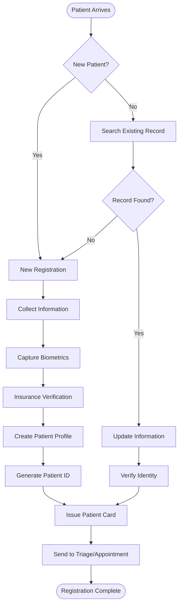
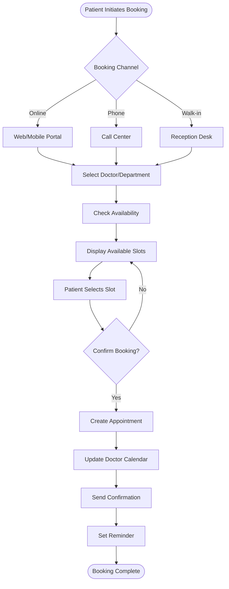
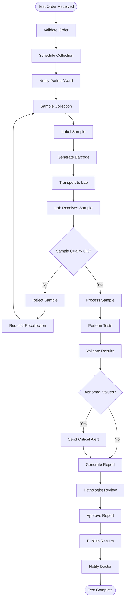
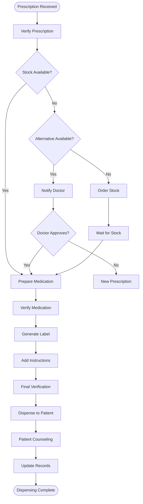
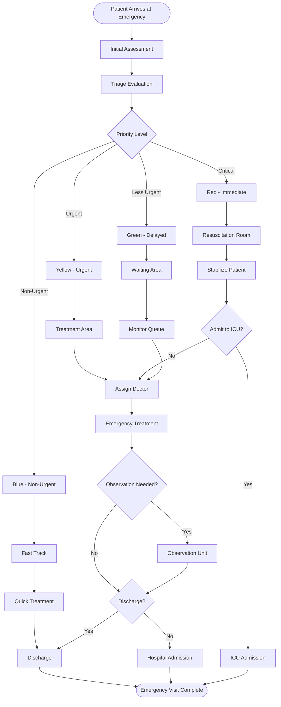
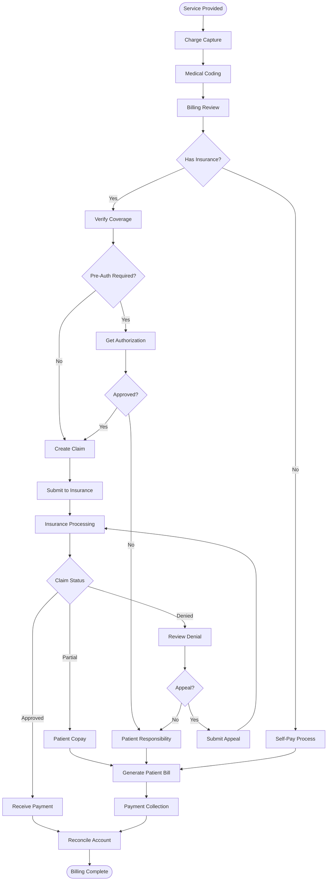
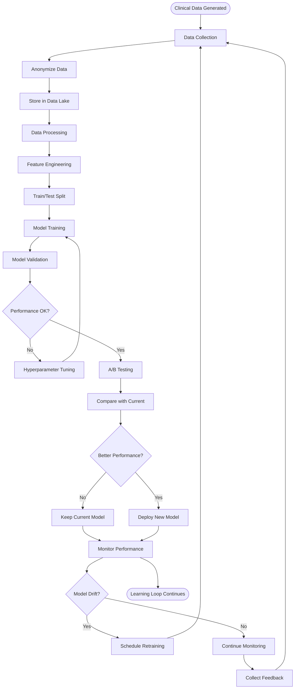
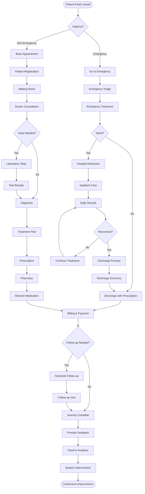
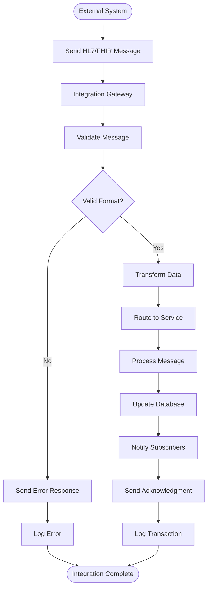

# Hospital Management System - Workflow Diagrams

## 1. Patient Registration & Onboarding Workflow

### 1.1 Patient Registration Flow


### 1.2 Data Flow in Registration
```
User Input → Validation → Duplicate Check → 
Insurance API → Database Storage → 
ID Generation → Card Printing → 
Notification Service → Queue Management
```

### 1.3 Technical Implementation
```yaml
API Endpoints:
  POST /api/patients/register
    Input:
      - Personal details
      - Insurance information
      - Emergency contacts
    Process:
      1. Validate input data
      2. Check for duplicates
      3. Verify insurance (async)
      4. Create patient record
      5. Generate unique ID
      6. Send welcome email/SMS
    Output:
      - Patient ID
      - Registration status
      
  GET /api/patients/search
    Input:
      - Name/Phone/Email/ID
    Process:
      1. Search in database
      2. Fuzzy matching
      3. Return matches
    Output:
      - List of matching patients
```

## 2. Appointment Booking Workflow

### 2.1 Appointment Scheduling Flow


### 2.2 Appointment Management System
```yaml
Appointment States:
  - REQUESTED: Initial booking request
  - CONFIRMED: Appointment confirmed
  - REMINDED: Reminder sent
  - CHECKED_IN: Patient arrived
  - IN_PROGRESS: Consultation ongoing
  - COMPLETED: Consultation done
  - CANCELLED: Appointment cancelled
  - NO_SHOW: Patient didn't arrive
  - RESCHEDULED: New time allocated

State Transitions:
  REQUESTED → CONFIRMED → REMINDED → CHECKED_IN → 
  IN_PROGRESS → COMPLETED
  
  Any State → CANCELLED (with reason)
  CONFIRMED → RESCHEDULED → CONFIRMED
```

### 2.3 Slot Management Algorithm
```python
# Pseudo-code for slot management
def get_available_slots(doctor_id, date):
    # Get doctor's schedule
    schedule = get_doctor_schedule(doctor_id, date)
    
    # Get existing appointments
    appointments = get_appointments(doctor_id, date)
    
    # Calculate available slots
    available_slots = []
    for slot in schedule.working_hours:
        if not is_slot_booked(slot, appointments):
            if check_buffer_time(slot):
                available_slots.append(slot)
    
    # Apply overbooking rules if enabled
    if schedule.allow_overbooking:
        available_slots.extend(get_overbook_slots())
    
    return available_slots
```

## 3. Clinical Consultation Workflow

### 3.1 Doctor-Patient Consultation Flow

```mermaid
graph TD
    Start([Patient Check-in]) --> Queue[Add to Queue]
    Queue --> Notify[Notify Doctor]
    Notify --> CallPatient[Call Patient]
    CallPatient --> StartConsult[Start Consultation]
    
    StartConsult --> History[Review Medical History]
    History --> Vitals[Check Vitals]
    Vitals --> Symptoms[Record Symptoms]
    Symptoms --> Examination[Physical Examination]
    
    Examination --> Tests{Tests Required?}
    Tests -->|Yes| OrderTests[Order Tests]
    Tests -->|No| Diagnosis[Make Diagnosis]
    
    OrderTests --> WaitResults[Wait for Results]
    WaitResults --> ReviewResults[Review Test Results]
    ReviewResults --> Diagnosis
    
    Diagnosis --> Treatment[Prescribe Treatment]
    Treatment --> Prescription[Generate Prescription]
    Prescription --> Instructions[Provide Instructions]
    Instructions --> FollowUp{Follow-up Needed?}
    
    FollowUp -->|Yes| ScheduleFollowUp[Schedule Follow-up]
    FollowUp -->|No| Discharge[Discharge]
    
    ScheduleFollowUp --> Discharge
    Discharge --> UpdateRecords[Update Medical Records]
    UpdateRecords --> Billing[Generate Bill]
    Billing --> End([Consultation Complete])
```


### 3.2 Clinical Decision Support Integration
```yaml
AI-Assisted Consultation:
  Symptom Analysis:
    Input: Patient symptoms, medical history
    Process: 
      - NLP processing of symptoms
      - Pattern matching with disease database
      - Risk factor analysis
    Output: Possible diagnoses with confidence scores
    
  Treatment Recommendation:
    Input: Diagnosis, patient profile, allergies
    Process:
      - Evidence-based medicine lookup
      - Drug interaction checking
      - Personalized treatment planning
    Output: Treatment options ranked by effectiveness
    
  Test Suggestion:
    Input: Symptoms, preliminary diagnosis
    Process:
      - Diagnostic protocol matching
      - Cost-benefit analysis
      - Urgency assessment
    Output: Recommended tests with priority
```

## 4. Laboratory Workflow

### 4.1 Lab Test Processing Flow


### 4.2 Sample Tracking System
```yaml
Sample Lifecycle:
  States:
    - ORDERED: Test ordered by doctor
    - SCHEDULED: Collection scheduled
    - COLLECTED: Sample collected
    - IN_TRANSIT: Being transported
    - RECEIVED: Received at lab
    - PROCESSING: Under testing
    - COMPLETED: Testing done
    - VALIDATED: Results validated
    - REPORTED: Report generated
    - DELIVERED: Results delivered
    
  Tracking Information:
    - Barcode/RFID ID
    - Collection time & location
    - Collector information
    - Transport details
    - Processing timestamps
    - Quality metrics
    - Chain of custody
```

## 5. Pharmacy Workflow

### 5.1 Prescription Processing Flow


### 5.2 Drug Interaction Checking
```python
# Drug Interaction Algorithm
def check_drug_interactions(new_drug, patient_id):
    interactions = []
    
    # Get patient's current medications
    current_meds = get_patient_medications(patient_id)
    
    # Get patient's allergies
    allergies = get_patient_allergies(patient_id)
    
    # Check drug-drug interactions
    for med in current_meds:
        interaction = check_interaction(new_drug, med)
        if interaction:
            interactions.append({
                'type': 'drug-drug',
                'severity': interaction.severity,
                'description': interaction.description
            })
    
    # Check drug-allergy interactions
    for allergy in allergies:
        if check_allergy_interaction(new_drug, allergy):
            interactions.append({
                'type': 'allergy',
                'severity': 'high',
                'description': f'Patient allergic to {allergy}'
            })
    
    # Check drug-condition interactions
    conditions = get_patient_conditions(patient_id)
    for condition in conditions:
        interaction = check_condition_interaction(new_drug, condition)
        if interaction:
            interactions.append({
                'type': 'drug-condition',
                'severity': interaction.severity,
                'description': interaction.description
            })
    
    return interactions
```

## 6. Emergency Department Workflow

### 6.1 Emergency Triage Flow


### 6.2 Emergency Response System
```yaml
Alert System:
  Code Blue (Cardiac Arrest):
    - Trigger: Manual button / Monitor alert
    - Response Team: Crash team
    - Equipment: Crash cart auto-dispatched
    - Notification: All relevant staff paged
    - Documentation: Auto-start recording
    
  Code Red (Fire):
    - Trigger: Fire alarm / Manual
    - Response: Evacuation protocol
    - Systems: Auto-close fire doors
    - Notification: Fire department
    
  Mass Casualty:
    - Trigger: External alert / Manual
    - Response: Disaster protocol
    - Resources: All hands called
    - Systems: Switch to disaster mode
```

## 7. Billing & Insurance Workflow

### 7.1 Billing Process Flow


### 7.2 Revenue Cycle Management
```yaml
Revenue Cycle Stages:
  1. Pre-Registration:
     - Insurance verification
     - Eligibility check
     - Prior authorization
     
  2. Registration:
     - Demographic capture
     - Insurance information
     - Financial counseling
     
  3. Charge Capture:
     - Service documentation
     - CPT/ICD coding
     - Charge entry
     
  4. Claim Submission:
     - Claim scrubbing
     - Electronic submission
     - Paper claim backup
     
  5. Payment Processing:
     - EOB processing
     - Payment posting
     - Denial management
     
  6. Patient Collections:
     - Statement generation
     - Payment plans
     - Collection agency referral
     
  7. Reporting:
     - A/R aging
     - Denial analytics
     - Revenue analytics
```

## 8. AI Learning Loop Workflow

### 8.1 Continuous Learning Process


### 8.2 Feedback Integration System
```python
# Feedback Loop Implementation
class FeedbackLoop:
    def __init__(self):
        self.feedback_queue = Queue()
        self.model_performance = {}
        
    def collect_feedback(self, prediction, actual_outcome, context):
        feedback = {
            'timestamp': datetime.now(),
            'prediction': prediction,
            'actual': actual_outcome,
            'context': context,
            'accuracy': self.calculate_accuracy(prediction, actual_outcome)
        }
        self.feedback_queue.put(feedback)
        
    def process_feedback_batch(self):
        batch = []
        while not self.feedback_queue.empty():
            batch.append(self.feedback_queue.get())
        
        if len(batch) > 0:
            # Update performance metrics
            self.update_metrics(batch)
            
            # Check for drift
            if self.detect_drift(batch):
                self.trigger_retraining()
            
            # Store for future training
            self.store_training_data(batch)
    
    def detect_drift(self, batch):
        # Statistical tests for drift detection
        current_accuracy = np.mean([f['accuracy'] for f in batch])
        baseline_accuracy = self.model_performance['baseline_accuracy']
        
        # Use statistical test (e.g., Kolmogorov-Smirnov)
        drift_detected = abs(current_accuracy - baseline_accuracy) > 0.05
        
        return drift_detected
    
    def trigger_retraining(self):
        # Schedule model retraining
        retraining_job = {
            'model_id': self.model_id,
            'trigger_reason': 'drift_detected',
            'timestamp': datetime.now(),
            'priority': 'high'
        }
        schedule_retraining(retraining_job)
```

## 9. Patient Journey - Complete Flow

### 9.1 End-to-End Patient Journey


### 9.2 Data Flow Through Patient Journey
```yaml
Data Collection Points:
  Registration:
    - Demographics
    - Insurance details
    - Medical history
    - Consent forms
    
  Triage/Consultation:
    - Vital signs
    - Symptoms
    - Clinical notes
    - Examination findings
    
  Diagnostics:
    - Test orders
    - Sample data
    - Test results
    - Images
    
  Treatment:
    - Diagnosis codes
    - Treatment plans
    - Prescriptions
    - Procedure notes
    
  Pharmacy:
    - Dispensing records
    - Drug interactions
    - Patient counseling
    
  Billing:
    - Service charges
    - Insurance claims
    - Payment records
    
  Follow-up:
    - Progress notes
    - Outcome measures
    - Patient feedback
    
Data Integration:
  - All data points feed into EHR
  - Real-time updates across systems
  - AI/ML models learn from data
  - Analytics generate insights
  - Feedback improves processes
```

## 10. System Integration Workflows

### 10.1 HL7/FHIR Integration Flow


### 10.2 Real-time Monitoring Dashboard Flow
```yaml
Dashboard Data Flow:
  Data Sources:
    - Patient vitals (every 1 minute)
    - Bed occupancy (real-time)
    - Emergency queue (real-time)
    - Lab results (on completion)
    - Staff availability (every 5 minutes)
    
  Processing Pipeline:
    1. Data Collection:
       - WebSocket connections
       - REST API polling
       - Event streams
       
    2. Data Aggregation:
       - Time-window aggregation
       - Statistical calculations
       - Trend analysis
       
    3. Alert Generation:
       - Threshold monitoring
       - Anomaly detection
       - Predictive alerts
       
    4. Visualization:
       - Real-time charts
       - Heat maps
       - Status indicators
       - Predictive trends
       
  Update Mechanism:
    - WebSocket push for critical data
    - Server-sent events for updates
    - Polling for non-critical metrics
    - Differential updates only
```

---

*These workflow diagrams provide detailed insights into how each module operates and integrates within the hospital management system. Each workflow is designed for efficiency, accuracy, and seamless user experience.*
